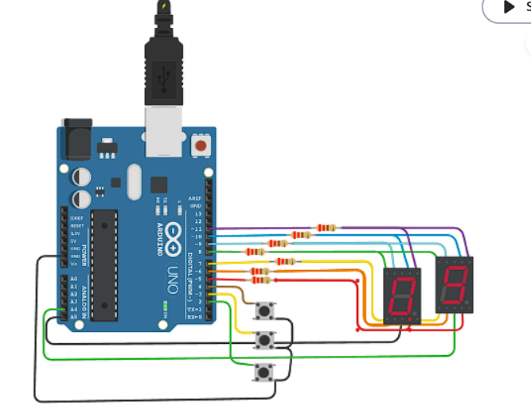

# Ejemplo Documentación 

## Alumno
- Carnelos Duarte Joaquin Alejo

## Proyecto: Contador binario.

## Descripción
Como piden las consignas del parcial, este arduino ofrece un contador de numeros normales y negativos, el cual se ve reflejado en un display de 7 segmentos.
Los 3 botones que estan a la vista sirven para interactuar con los displays

## Función principal
  Vamos directamente al loop el cual condiciona el acceso al sistema, tambien dejamos el mismo sistema a la vista

  Con un vistazo a estas dos funciones tenemos un panorama general del tinkercad.

void loop()//logica del proceso
{
  int presion = estados_presion_boton();
	if(presion==SUBE) //cuando suba,baje y resetee. Manejo del digito
    {
     presion_sube();
    }
  	else if(presion==BAJA)
    {
      presion_baja();
    }
   	else if(presion==RESET)
    {
     contador=0;
    }
	
  	cuentaDisplay(contador);//reflejo entre el display y la cuenta
}

void presion_sube()
{
  contador++;
  if(contador>99){
    contador=0;
  }
}

void presion_baja()
{
  contador--;
  if(contador<0){
      contador=99;
  }
}

## :robot: Link al proyecto
- [proyecto](https://www.tinkercad.com/things/kCfR0ujsA8J?sharecode=iV9mXHEFxM3TK2bNFlhRyc5ZcjT5s7arDIsjgMA9LAw)
