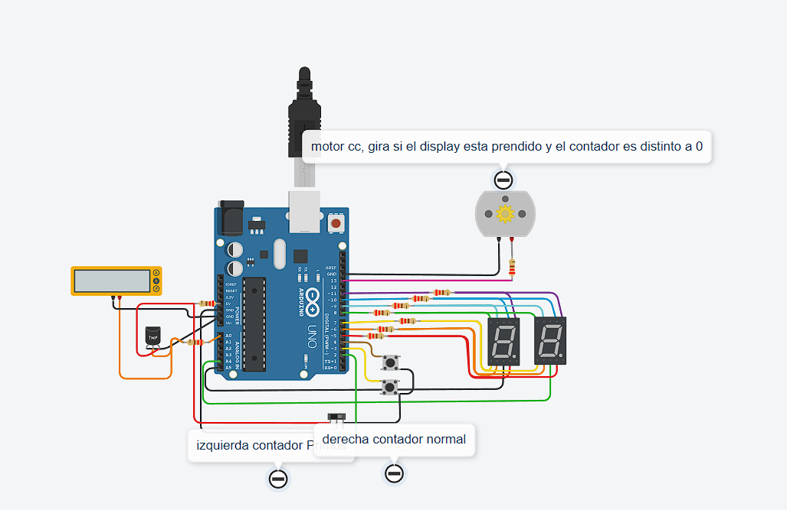

## Alumno
- Carnelos Duarte Joaquin Alejo

## Proyecto: Primer Parcial

## Descripción
Como piden las consignas del parcial, este arduino ofrece un contador de numeros normales y negativos, el cual se ve reflejado en un display de 7 segmentos.
Dependiendo los modos sera diferente el comportamiento del motor

## Función principal
  Vamos directamente al loop el cual condiciona el acceso al sistema, tambien dejamos el mismo sistema a la vista

  Con un vistazo a estas dos funciones tenemos un panorama general del tinkercad.

(Breve explicación de la función)
  void loop() {
  int lecturaSensor = analogRead(SENSOR_TEMP);
  temperatura = map(lecturaSensor, 20, 358, -40, 125);
  
  slice = digitalRead(SLICE);

  // Imprimir la temperatura
  Serial.print("Temperatura: ");
  Serial.println(temperatura);

  // Determinar el modo basado en la temperatura
  if (temperatura < 50 and slice == HIGH) {
    modo = 1;
    girar(); // Modo primos
  } else if (temperatura >= 50 and slice == LOW) {
    modo = 0;  // Modo normal
    detenerMotor();
  }

  // Resto del código basado en el modo
  if (modo == 1) {
    modoPrimos();
  } else if (modo == 0) {
    modoNormal();
  }
}

## :robot: Link al proyecto
- [proyecto](https://www.tinkercad.com/things/4OrhnDuV6G9?sharecode=cDRavcDf2Z3wmeqXyDsb9cM52B5JimiaCkc3ojObQlo)

