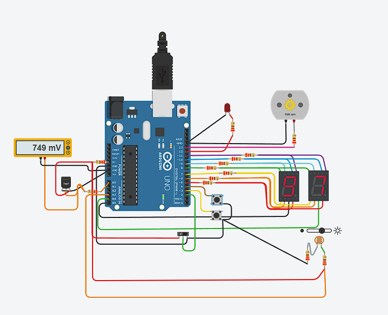

## Primer Parcial Parte 3

## Alumno
- Carnelos Duarte Joaquin Alejo

## Proyecto: Primer Parcial

## Descripción
Como piden las consignas del parcial, este arduino ofrece un contador de numeros normales y negativos, el cual se ve reflejado en un display de 7 segmentos.
Para prender el sistema hay que usar la fotoresistencia y para desenvolverse en el mismo debemos utilizar tanto el slice como el tmp.

## Función principal
  Vamos directamente al loop el cual condiciona el acceso al sistema, tambien dejamos el mismo sistema a la vista

  Con un vistazo a estas dos funciones tenemos un panorama general del tinkercad.

  void loop() {
    int lecturaLuz = analogRead(FOTORESISTENCIA);
    if (lecturaLuz <1000) {
    // Serial.print("Luz: ");
    // Serial.println(lecturaLuz); para averiguar el limite de mi fotoresistencia use un print
      sistema();
    }
    else{
      digitalWrite(ledApagado, HIGH);
      detenerMotor();
      apagarDisplay();}
  }

  void sistema() {
    
    digitalWrite(ledApagado, LOW);
    
    int lecturaSensor = analogRead(SENSOR_TEMP);
    temperatura = map(lecturaSensor, 20, 358, -40, 125);
    
    slice = digitalRead(SLICE);

    girar();
    // El cambio de modos entre normales y primos solo se da si cambio la temperatura y apreto el boton, sino el contador seguira en el mismo modo
    //el sistema no prende a menos de que si o si se cumplan las condiciones de temperatura y slice
    if (temperatura < 50 && slice == HIGH) {
      modoPrimos();
    } else if (temperatura >= 50 && slice == LOW) {
      modoNormal();  
    }

  }

## :robot: Link al proyecto
- [proyecto](https://www.tinkercad.com/things/5JUe8FItEnv?sharecode=h_IaQiOU2XKbmI-hTpRlZ57o_pB4XmzIa56Sm0CUqRg)

## :tv: Link al video del proceso
- [video](https://www.youtube.com/watch?v=8pjSdELsRxI)
